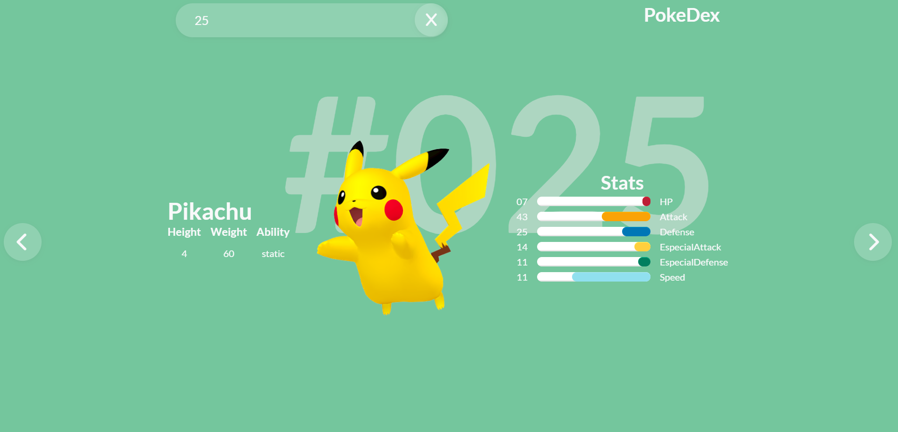

# PokeDex With PokeApi

PokeDex which you can search for the name or ID of the Pokemon , and you can click on the arrows to see the next or previous Pokemon and show  some information about the Pokemon.
## Screenshots

## 🔗 link
🐲 https://renansouza12.github.io/Calculator/

## Stack used

**Front-end:** Html, JavaScript, Sass css

